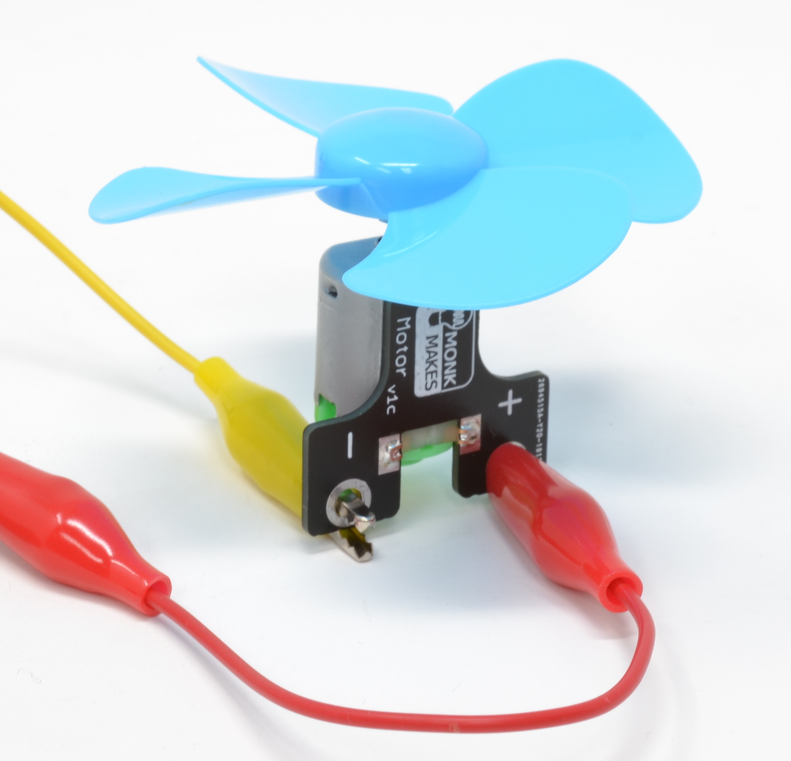

# Propuestas

## Electronic starter Kit MonkMakes para micro:bit

### Aerogenerador

## Nezha Inventor's kit

[Nezha Inventor's Kit](https://www.elecfreaks.com/nezha-inventor-s-kit-for-micro-bit-without-micro-bit-board.html)

## Kit de ciencia y domótica

[Kit micro:bit](https://www.elecfreaks.com/micro-bit-tinker-kit.html)

[Kit de ciencia del clima: micro:bit](https://www.elecfreaks.com/micro-bit-smart-science-iot-kit.html)

[kit smart home: micro:bit](https://www.elecfreaks.com/micro-bit-smart-home-kit.html)

## Seguidor solar con Arduino

[Seguidor Solar con Arduino](https://es.aliexpress.com/item/4000955310103.html)

[códgo](https://github.com/shihaipeng03/Sunflower)
[Proyecto original](https://create.arduino.cc/editor/wjd76/e225717a-ae15-4282-98bd-f9cf09400bee/preview)

## Impresora bluetooth

[Impresora Bluetooth](https://es.aliexpress.com/item/4000955514862.html)

[Código y documentación](https://github.com/shihaipeng03/MiniTelegraph)

## Robot dibujo pared

[V1](https://es.aliexpress.com/item/4000955112856.html)

[V2](https://es.aliexpress.com/item/1005002091114310.html)